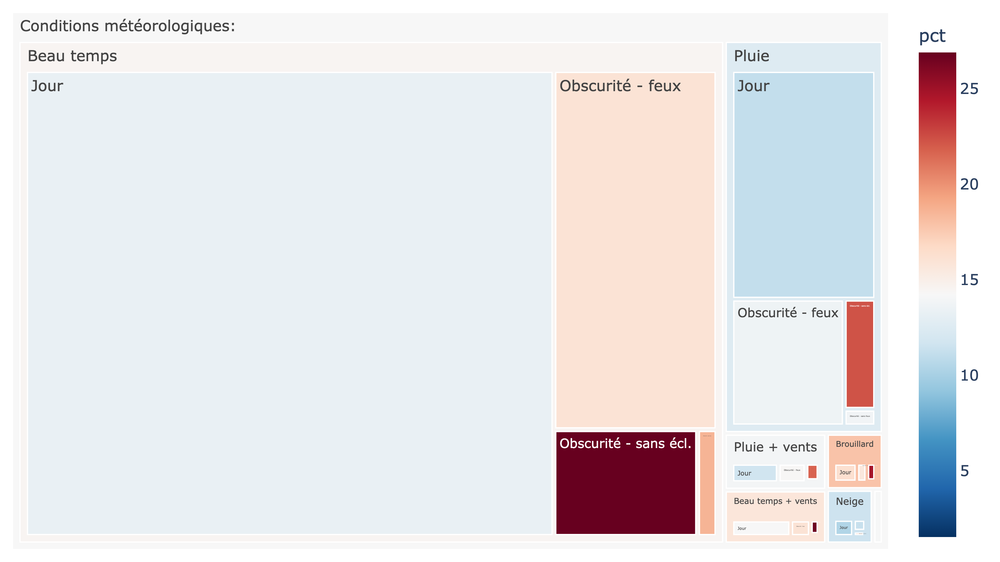

Sur cette page est expliquée la démarche que nous adoptons pour comprendre les données que nous avons entre les mains après les avoir nettoyées.

L'objectif de cette analyse est d'explorer visuellement les données pour identifier les facteurs qui ont une influence sur la **gravité des accidents**. Pour chaque graphique, nous regroupons les données par catégorie (comme l'âge, la météo, ou la vitesse) et nous calculons le **pourcentage d'accidents graves** pour ce groupe. C'est cet indicateur de risque qui nous permet de faire des interprétations.

---

## 👶👴 Gravité par Âge du Conducteur

Ce graphique montre la relation entre l'âge du conducteur et le risque qu'un accident soit grave.

[../pictures/driver_age.png]

**Explication des catégories :**
* L'**axe horizontal (X)** représente l'âge du conducteur, de 18 à 85 ans.
* L'**axe vertical (Y)** est le pourcentage d'accidents classés comme "Sévères" (c'est-à-dire fatals ou sérieux).
* La **ligne bleue ("Pourcentage Original")** montre les données brutes pour chaque âge, qui peuvent fluctuer.
* La **ligne rouge ("Moyenne Mobile")** lisse ces fluctuations pour révéler la tendance de fond.

**Interprétation :**
Les données révèlent une tendance très claire en forme de "U". Le risque est élevé pour les **jeunes conducteurs (18-25 ans)**, commençant autour de 16% et diminuant avec l'âge. Cela s'explique probablement par un manque d'expérience combiné à une plus grande prise de risque. Le risque diminue ensuite pour atteindre son point le plus bas vers 40-45 ans (environ 14.5%), la période où l'expérience est maximale. Enfin, le risque **augmente de façon continue et marquée chez les conducteurs seniors (60+ ans)** , dépassant 22%. Cela n'est pas nécessairement dû à une conduite plus agressive, mais plutôt à des temps de réaction potentiellement plus lents et à une plus grande fragilité physique, qui transforment un accident en un événement plus grave.

---

## ☀️🌙 Météo et Visibilité

Ce graphique est un "treemap" (carte proportionnelle) qui décompose les accidents par conditions météorologiques et de visibilité.

**Explication des catégories :**
* La **taille des rectangles** est proportionnelle au **volume total** d'accidents survenus dans cette condition (la catégorie "Beau temps" de "Jour" est la plus grande).
* La **couleur des rectangles** indique le **pourcentage de gravité** (le risque), sur une échelle allant du bleu (faible risque, ~5%) au rouge foncé (risque élevé, ~25%).
* Les catégories principales (ex: "Beau temps" , "Pluie" ) sont subdivisées par conditions de visibilité (ex: "Jour" , "Obscurité - feux" , "Obscurité - sans écl." ).

**Interprétation :**
La grande majorité des accidents survient par **"Beau temps"** et de **"Jour"** (le plus grand rectangle). C'est logiquement la condition la moins risquée, avec un taux de gravité de **14.8%**. Le risque augmente considérablement lorsque la visibilité se dégrade. La condition la plus dangereuse de toutes est **"Beau temps"** en **"Obscurité - sans écl."** (conduire de nuit sur une route sans éclairage public), avec un taux de gravité spectaculaire de **28.0%**. Paradoxalement, conduire sous la "Pluie" de "Jour" est moins risqué (**11.8%**) que par beau temps de jour, sans doute parce que les conducteurs réduisent instinctivement leur vitesse et augmentent leur vigilance.

---

## 🛣️💨 Conditions de Route et Limite de Vitesse

Ce second treemap utilise la même logique pour analyser l'impact de la limite de vitesse et du type de route.

[../pictures/route.png]

**Explication des catégories :**
* La **taille des rectangles** représente le **volume total** d'accidents.
* La **couleur des rectangles** représente le **pourcentage de gravité** (le risque) .
* Les blocs sont d'abord groupés par limite de vitesse (ex: "Limite : 30 mph" , "Limite : 60 mph" ). Ces groupes sont ensuite divisés par type de route (ex: "Route à chaussée unique" , "Rond-point" ).

**Interprétation :**
Le plus grand volume d'accidents a lieu sur les routes à **"Limite : 30 mph"** et **"Route à chaussée unique"**. Cela correspond aux routes urbaines denses, qui, heureusement, ont un taux de gravité relativement faible de **13.7%**. L'analyse montre que le danger est moins lié à la vitesse limite seule qu'à la *combinaison* de la vitesse et du type de route. Le scénario le plus dangereux est de loin la **"Limite : 60 mph"** sur **"Route à chaussée unique"** (routes de campagne, souvent sinueuses et sans séparation centrale), avec un taux de gravité de **24.7%**. Les routes à 70 mph, qui sont presque exclusivement des "Routes à chaussées séparées" (autoroutes), sont paradoxalement moins dangereuses (**15.7%**) car elles sont mieux conçues et n'ont pas de trafic en sens inverse.

---

## 📅☀️ Analyse de Saisonnalité (Jour et Mois)

Cette carte de chaleur (heatmap) croise les jours de la semaine avec les mois de l'année pour identifier des tendances temporelles.

[../pictures/seasonality.png]

**Explication des catégories :**
* L'**axe vertical (Y)** liste les jours de la semaine, de Lundi à Dimanche.
* L'**axe horizontal (X)** liste les mois de l'année.
* **Couleur et Chiffres** : Chaque cellule représente le **pourcentage moyen d'accidents graves** pour cette combinaison. Les couleurs sombres (bleu/vert) indiquent un faible risque, tandis que les couleurs claires (jaune) indiquent un risque élevé.

**Interprétation :**
On observe deux tendances très nettes.
1.  **Tendance hebdomadaire** : Il y a une différence très nette between la semaine et le week-end. Les accidents sont **significativement plus graves le Samedi et le Dimanche** (cellules plus claires, ~16-20%) que du Lundi au Vendredi (cellules sombres, ~14-15.5%) . Cela peut s'expliquer par une nature de conduite différente (plus de loisirs, longs trajets) et malheureusement une **probabilité plus élevée de conduite sous l'influence de l'alcool** lors des soirées du week-end.
2.  **Tendance annuelle** : Le risque augmente pendant **l'été et le début de l'automne** (Juin à Octobre). Cette période coïncide avec les **vacances scolaires** et les grands départs en congés, ce qui génère plus de trafic de longue distance sur des routes rapides, par opposition aux trajets quotidiens domicile-travail, souvent plus courts et plus lents.

---

## 🚗💥 Gravité par Âge du Véhicule

Ce dernier graphique est un nuage de points qui montre l'influence de l'âge d'un véhicule sur la gravité d'un accident.

[../pictures/vehicle_age.png]

**Explication des catégories :**
* L'**axe horizontal (X)** représente l'**âge du véhicule** en années.
* L'**axe vertical (Y)** représente le **pourcentage de collisions graves**.
* La **taille de chaque bulle** indique le **volume total** d'accidents pour cet âge. Les grosses bulles (comme celles entre 0 et 10 ans) représentent un grand nombre d'accidents .
* La **couleur** passe du bleu (faible risque) au jaune/violet (risque élevé) à mesure que le risque augmente.

**Interprétation :**
La taille des bulles montre que la majorité des accidents impliquent des véhicules relativement récents (les **grosses bulles sont concentrées entre 0 et 13 ans**). Le risque (position Y et couleur) est élevé pour les véhicules neufs (0-2 ans), puis **diminue pour les véhicules de 3 à 13 ans** (la "cuvette" de la courbe). Cependant, le risque **augmente de façon spectaculaire pour les véhicules de plus de 14 ans**. L'interprétation est que les véhicules plus anciens manquent de **dispositifs de sécurité modernes** (airbags avancés, contrôle de stabilité, conception de châssis absorbant les chocs) et sont plus susceptibles de défaillances, rendant les impacts identiques beaucoup plus graves pour les occupants.