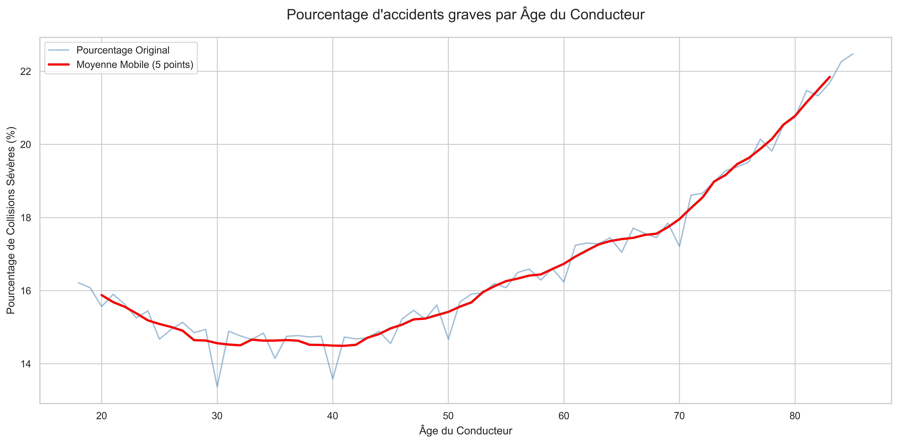
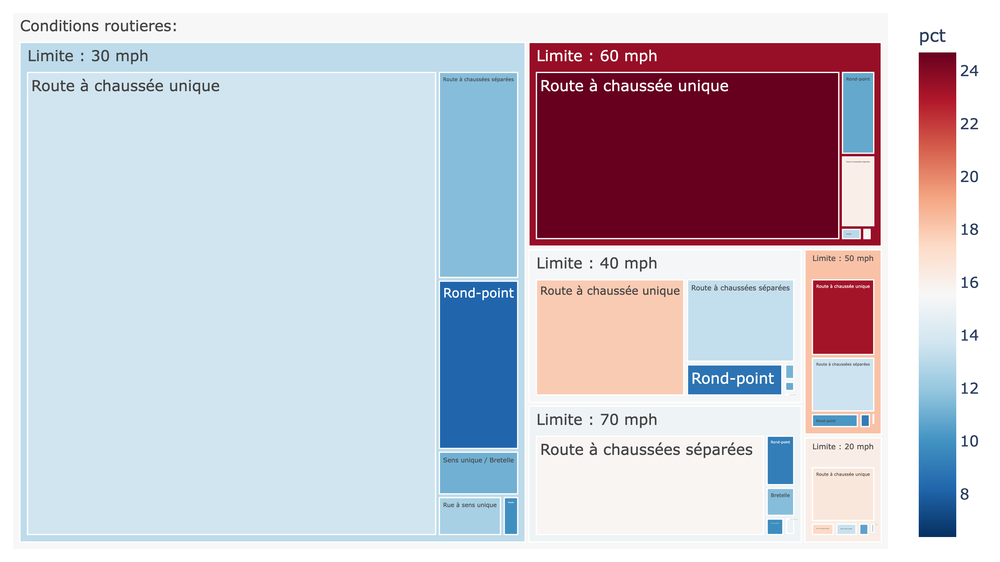
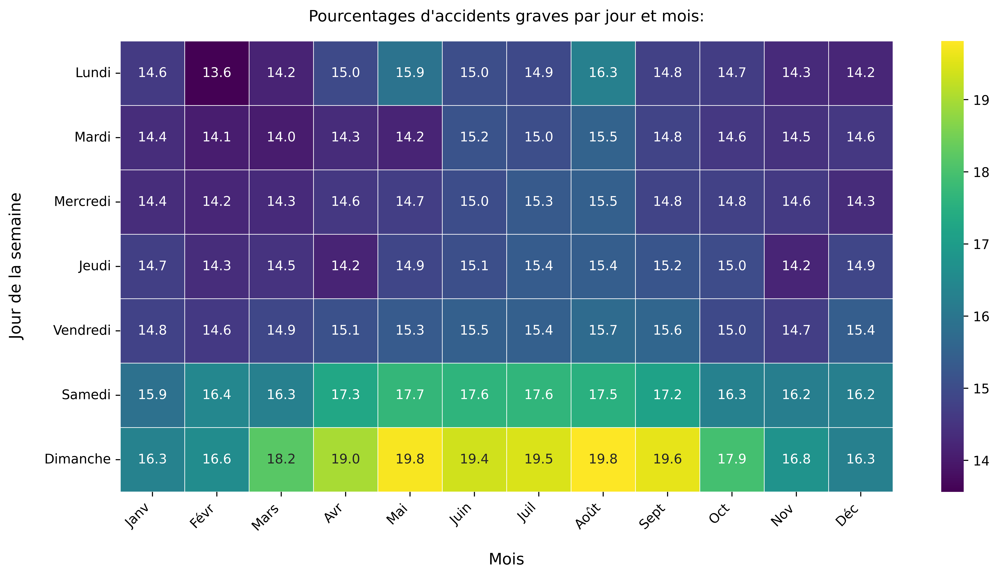
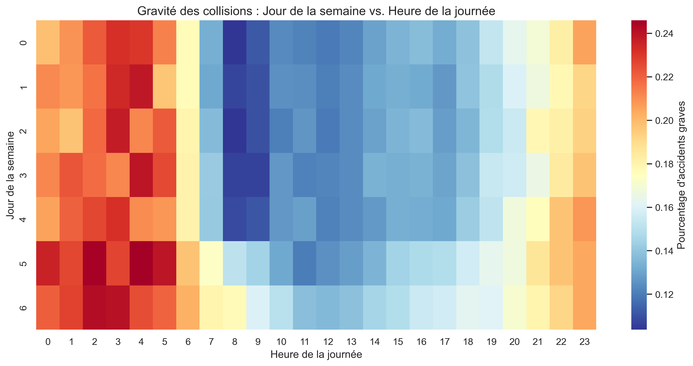
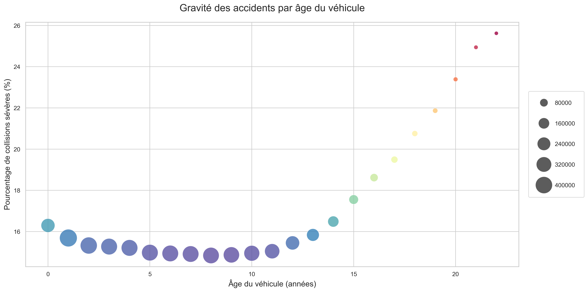

## 👴 Gravité par Âge du Conducteur

Ce graphique montre la relation entre l'âge du conducteur et le risque qu'un accident soit grave.

**Interprétation :**
Les données révèlent une tendance en forme de "U". Le risque est élevé pour les **jeunes conducteurs (18-25 ans)**, commençant autour de 16% et diminuant avec l'âge. Le risque diminue ensuite pour atteindre son point le plus bas vers 40-45 ans (environ 14.5%), période où l'expérience est maximale. Enfin, le risque **augmente de façon continue chez les conducteurs seniors (60+ ans)**, dépassant 22%. Cela s'explique par une plus grande fragilité physique, transformant un accident en événement plus grave.

---

## ☀️ Météo et Visibilité

Ce graphique "treemap" décompose les accidents par conditions météorologiques et de visibilité.

**Interprétation :**
La majorité des accidents survient par **"Beau temps"** et de **"Jour"** (le plus grand rectangle), avec un taux de gravité modéré. La condition la plus dangereuse est **"Beau temps"** en **"Obscurité - sans écl."** (nuit noire), avec un taux de gravité de **28.0%**. Paradoxalement, la conduite sous la pluie de jour est moins risquée, probablement grâce à une vigilance accrue des conducteurs.

---

## 🛣️ Conditions de Route et Limite de Vitesse

Analyse de l'impact de la limite de vitesse et du type de route.

**Interprétation :**
Le plus grand volume d'accidents a lieu en ville (**30 mph**). Le scénario le plus dangereux est la **"Limite : 60 mph"** sur **"Route à chaussée unique"** (routes de campagne), avec un taux de gravité de **24.7%**. Les autoroutes (70 mph) sont moins dangereuses proportionnellement, car elles sont conçues pour limiter les chocs frontaux.

---

## 📅 Analyse de Saisonnalité (Jour et Mois)

Cette carte de chaleur croise les jours de la semaine avec les mois.

**Interprétation :**
1.  **Hebdomadaire** : Les accidents sont **significativement plus graves le Week-end** (Samedi/Dimanche).
2.  **Annuelle** : Le risque augmente pendant l'été et le début de l'automne, coïncidant avec les périodes de vacances et les trajets longue distance.

---

## ⌚ Gravité par Heure et Jour

Cette analyse croise le jour de la semaine avec l'heure précise de la journée.

**Explication :**
* **Axe X** : Heure de la journée (0 à 23h).
* **Axe Y** : Jour de la semaine (0=Lundi à 6=Dimanche).
* **Couleur** : Le rouge indique une forte probabilité d'accident grave.

**Interprétation :**
On observe une dichotomie très nette :
* **La nuit (Zone Rouge)** : La gravité est maximale entre **00h00 et 05h00**, particulièrement les samedis et dimanches matins. Cela suggère un lien fort avec la fatigue, la vitesse sur route dégagée et potentiellement l'alcool.
* **Les Heures de Pointe (Zone Bleue)** : Bien que fréquentes en nombre d'accidents, les heures de pointe (08h-09h et 17h-18h) présentent une gravité faible, car la congestion du trafic force les véhicules à circuler lentement.

---

## 🚗 Gravité par Âge du Véhicule

Ce graphique montre l'influence de l'ancienneté du véhicule.

**Interprétation :**
Le risque est élevé pour les véhicules neufs, diminue pour les véhicules de 3 à 13 ans, puis **augmente spectaculairement pour les véhicules de plus de 14 ans**. Les véhicules anciens, manquant de dispositifs de sécurité modernes (airbags latéraux, absorption de chocs), protègent moins bien leurs occupants.