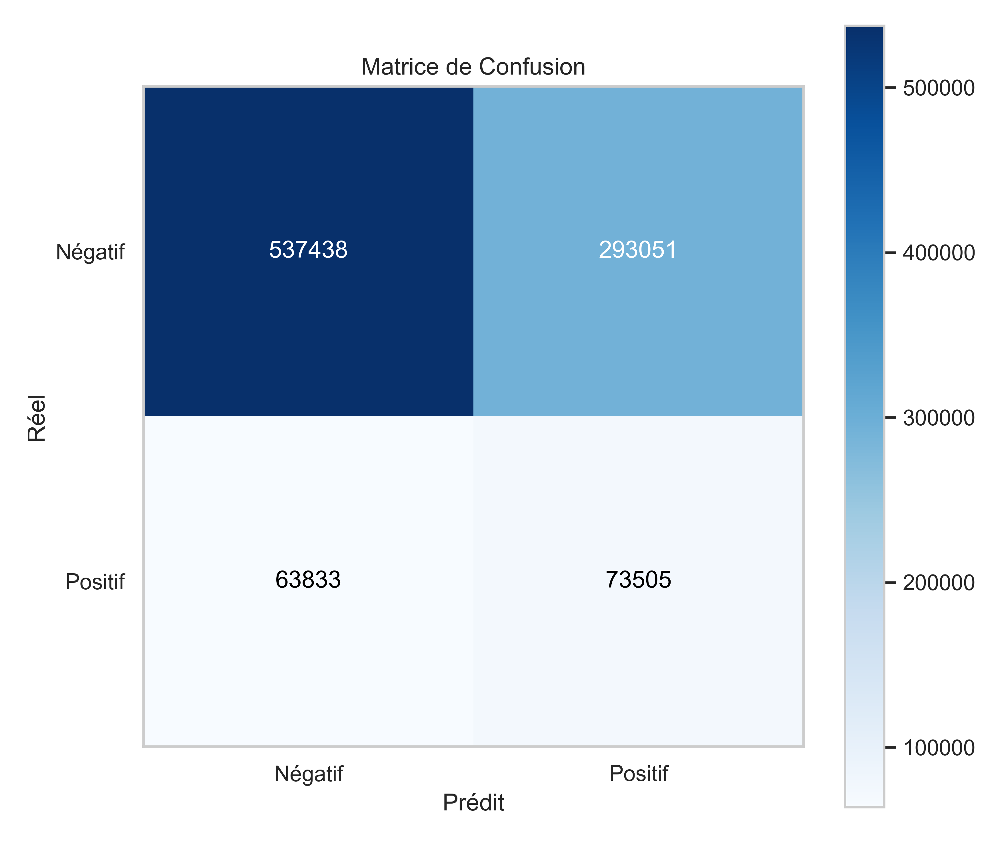
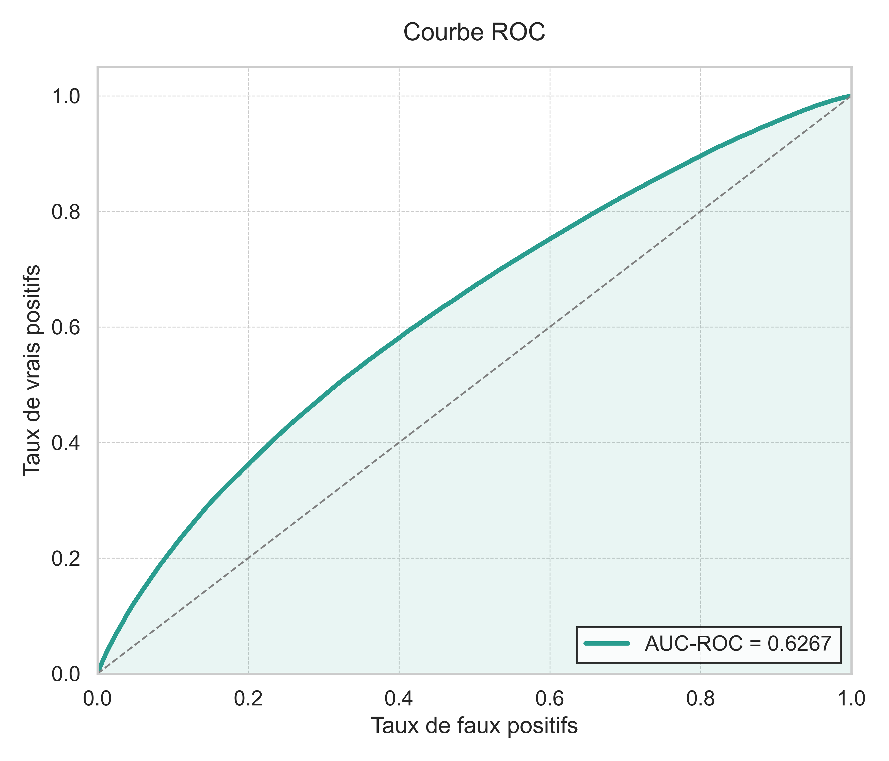
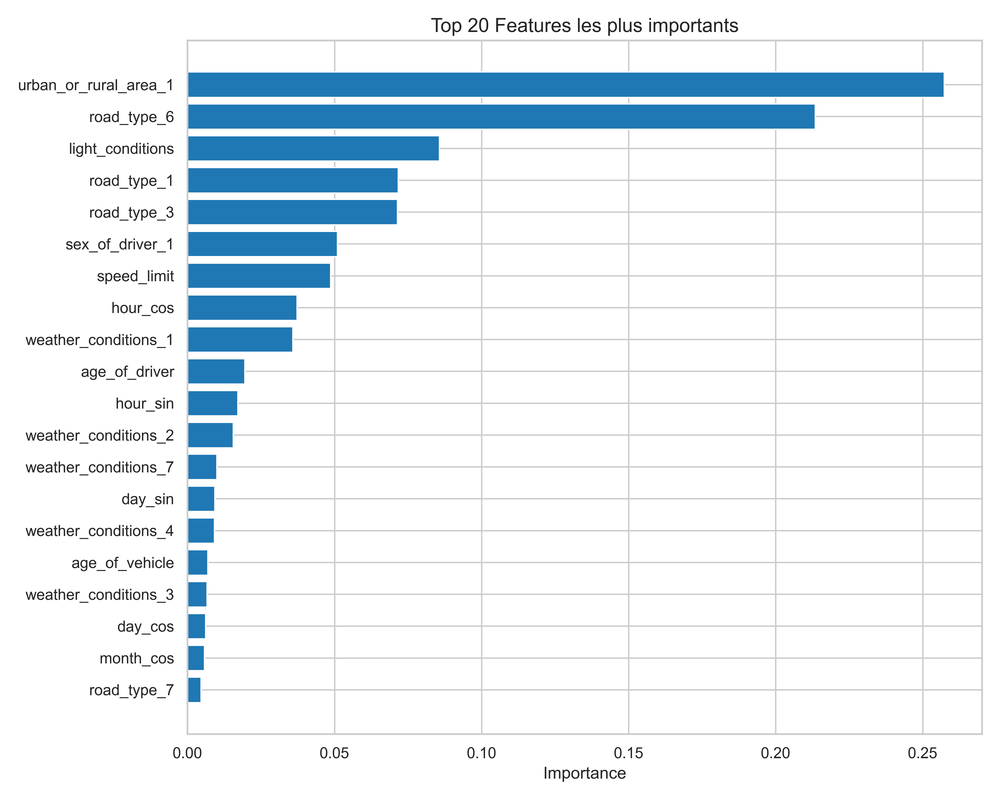
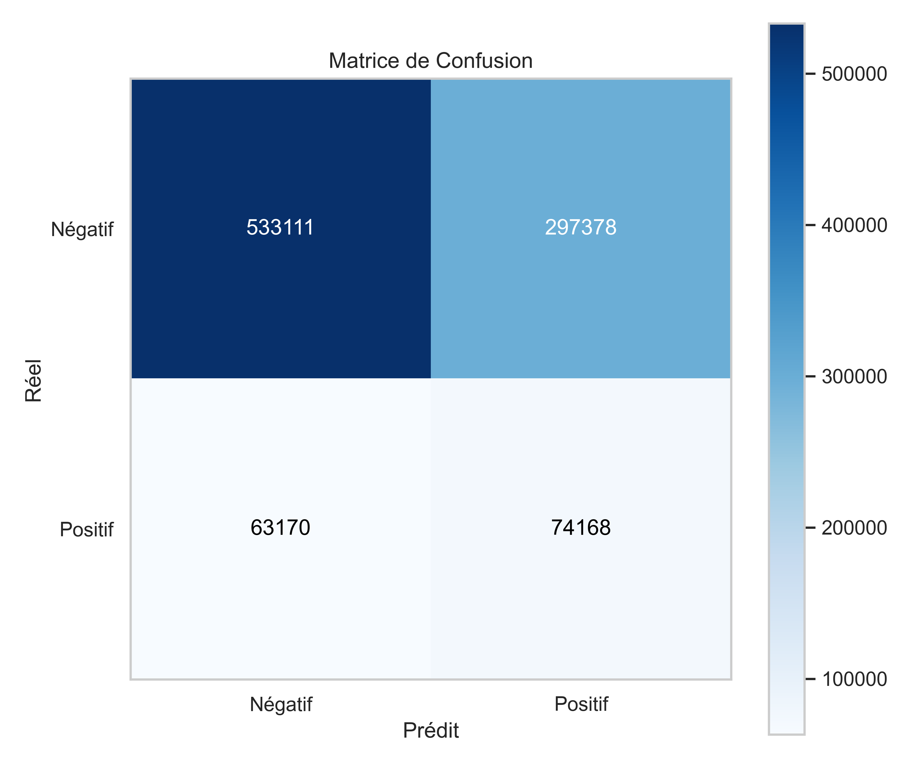
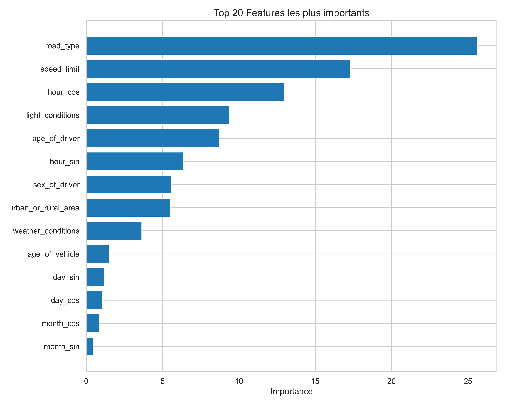
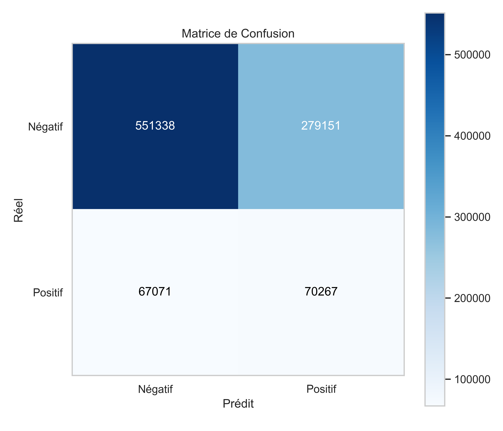
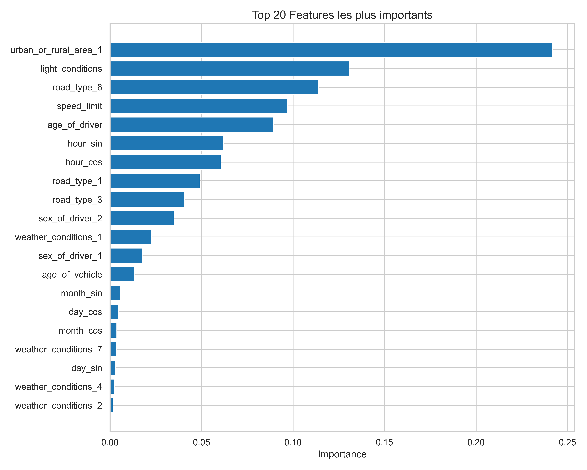

## 📊 1. Benchmark Global et Méthodologie

### Protocole d'Entraînement
Tous les modèles ont suivi le même pipeline rigoureux pour assurer une comparaison équitable :
* **Partitionnement** : 80% Entraînement / 20% Test.
* **Validation Croisée** : Stratified K-Fold (5 splits) pour valider la robustesse.
* **Gestion du Déséquilibre** : Application d'un poids de classe positif calculé dynamiquement (`scale_pos_weight` ≈ 6.04). Cela force le modèle à accorder 6 fois plus d'importance aux accidents graves.
* **Optimisation** : Recherche d'hyperparamètres via `GridSearchCV`.

### Tableau Comparatif des Performances

| Modèle | Score ROC AUC (CV) | Temps d'Entraînement | Vrais Positifs (Détectés) | Verdict |
| :--- | :---: | :---: | :---: | :--- |
| **XGBoost** | **0.6264** | **~9 min** (532s) | 73,552 | 🏆 **Meilleur Modèle** |
| **CatBoost** | 0.6261 | ~27 min (1643s) | **74,168** | 🥈 Excellent rappel, mais lent |
| **Decision Tree** | 0.6193 | ~18 min (1063s) | 70,267 | 🥉 Baseline de référence |

> **Analyse** : **XGBoost** remporte la compétition. Il offre le meilleur score AUC tout en étant 3 fois plus rapide que CatBoost. Bien que CatBoost détecte légèrement plus d'accidents graves (+600 cas), son coût computationnel est prohibitif pour un gain marginal.

---

## 🚀 2. Analyse Approfondie : XGBoost (Champion)

Le modèle XGBoost (eXtreme Gradient Boosting) a démontré la meilleure capacité de généralisation.

**Meilleurs Hyperparamètres trouvés :**
* `learning_rate`: 0.1
* `n_estimators`: 200
* `max_depth`: None (Géré par l'algorithme)

### A. Matrice de Confusion
La matrice de confusion nous permet de visualiser les erreurs du modèle sur le jeu de test.

**Interprétation des chiffres :**
* **Vrais Positifs (73 552)** : Le modèle a correctement identifié plus de 73 000 accidents graves. C'est le chiffre critique pour sauver des vies.
* **Faux Positifs (293 131)** : Le modèle a classé "Graves" des accidents qui étaient en réalité "Légers".
    * *Pourquoi est-ce élevé ?* C'est une conséquence volontaire du poids de classe (6.04). Dans un contexte de secours d'urgence, **il vaut mieux envoyer une ambulance pour rien (Faux Positif) que de ne pas l'envoyer sur un accident mortel (Faux Négatif)**. Le modèle est "prudemment pessimiste".
* **Faux Négatifs (63 786)** : Accidents graves manqués. Ce chiffre est minimisé autant que possible par l'optimisation.

### B. Courbe ROC
La courbe ROC illustre la performance du classifieur à différents seuils de discrimination.

**Analyse :**
L'aire sous la courbe (AUC) de **0.6264** indique que le modèle a une capacité discriminante supérieure à l'aléatoire (0.5). La courbe monte rapidement au début, ce qui signifie que le modèle est efficace pour identifier les cas les plus évidents de gravité avec peu de faux positifs initiaux.

### C. Importance des Variables (Feature Importance)
Quels facteurs influencent le plus la décision de XGBoost ?

**Analyse Métier :**
1.  **`road_type_6` (Route à chaussée unique)** : C'est de loin le facteur n°1 (~23%). Les routes de campagne bidirectionnelles sont statistiquement les plus meurtrières (chocs frontaux).
2.  **`urban_or_rural_area_1` (Zone Urbaine)** : Facteur protecteur majeur (~23%). En ville, la vitesse réduite diminue drastiquement la gravité.
3.  **`light_conditions`** : La luminosité (jour/nuit) arrive en 3ème position (~8%), confirmant que la visibilité est cruciale.

---

## 🐱 3. Analyse Approfondie : CatBoost

CatBoost (Categorical Boosting) est réputé pour sa gestion native des catégories, mais s'est avéré lourd à entraîner sur ce dataset volumineux.

**Meilleurs Hyperparamètres trouvés :**
* `learning_rate`: 0.1
* `n_estimators`: 200

### A. Matrice de Confusion

**Comparaison avec XGBoost :**
* **Vrais Positifs (74 168)** : CatBoost est légèrement plus "sensible". Il a détecté **616 accidents graves de plus** que XGBoost.
* **Faux Positifs (297 378)** : En contrepartie, il a généré environ 4 000 fausses alertes supplémentaires.
* L'équilibre est très similaire, mais CatBoost favorise légèrement plus le Rappel (Recall) au détriment de la Précision.

### B. Courbe ROC

**Analyse :**
Avec une AUC de **0.6261**, la courbe est quasi superposable à celle de XGBoost. La performance prédictive pure est équivalente. La différence principale réside donc dans le temps de calcul (27 min vs 9 min).

### C. Importance des Variables

**Divergence Notable :**
L'analyse des features de CatBoost est très différente de celle de XGBoost :
* **`road_type`** reste premier (~25%), confirmant la robustesse de ce facteur.
* **`speed_limit` (Limite de vitesse)** apparaît en 2ème position avec une importance massive de **17%** (contre seulement 5% pour XGBoost).
* Cela suggère que CatBoost arrive mieux à capturer la relation linéaire entre la limite de vitesse autorisée et la gravité du choc cinétique.

---

## 🌳 4. Analyse Approfondie : Decision Tree

L'arbre de décision sert de "Baseline". Il est plus simple et donc plus interprétable, mais capture moins de nuances complexes que les méthodes de Boosting.

**Meilleurs Hyperparamètres trouvés :**
* `criterion`: 'entropy' (Gain d'information)
* `max_depth`: 10 (Profondeur contrainte pour éviter le surapprentissage)

### A. Matrice de Confusion

**Analyse :**
* **Vrais Positifs (70 267)** : Le score le plus bas des trois modèles. Il "rate" environ 3 300 accidents graves comparé à XGBoost.
* **Faux Positifs (279 151)** : Il génère moins de fausses alertes.
* Ce modèle est plus conservateur. Dans notre contexte où la non-détection est grave, ce comportement est moins souhaitable.

### B. Courbe ROC

**Analyse :**
L'AUC de **0.6193** est inférieure aux méthodes de boosting. La forme de la courbe est moins "bombée", ce qui traduit une moins bonne séparation entre les classes graves et légères.

### C. Importance des Variables

**Analyse :**
L'arbre de décision a une structure hiérarchique qui privilégie des variables différentes :
1.  **`urban_or_rural_area_1`** : Premier critère de split (~24%).
2.  **`light_conditions`** : Deuxième critère (~13%).
3.  **`road_type_6`** : Troisième critère (~11%).

---

## ✅ Conclusion et Recommandations

Au terme de cette phase d'entraînement, nous pouvons tirer les conclusions suivantes :

1.  **Choix du Modèle** : Nous retenons **XGBoost** pour la mise en production. Il offre le meilleur équilibre performance/rapidité.
2.  **Facteurs de Risque** : Quel que soit le modèle, trois variables reviennent systématiquement comme prédicteurs clés : **le type de route (campagne), la zone (urbaine/rurale) et la luminosité**.
3.  **Stratégie de Seuil** : Les matrices de confusion montrent un grand nombre de Faux Positifs. Pour une application réelle, il serait pertinent d'ajouter une étape de calibration de probabilité ou de permettre à l'opérateur de régler la sensibilité du modèle (ajustement du seuil, actuellement à 0.5).